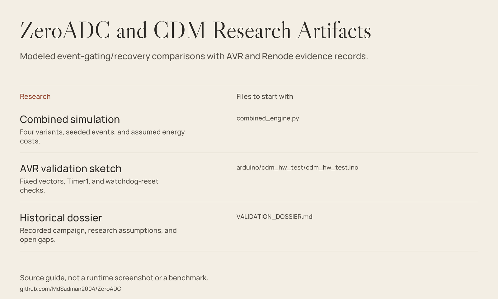

# ZeroADC — Event Gating & Deterministic Recovery Research



*Source guide drawn from the files in this repository; not a runtime screenshot or a fresh benchmark.*

**A research artifact collection for modeled Zero-ADC gating and Collatz Deterministic Modelling (CDM).**
Python kernels compare polling/gating and checkpoint/re-derivation combinations.
Arduino and Renode sources exercise deterministic token/FIR computations on
fixed input windows. Reports, JSON results, serial logs, and paper-generation
scripts preserve the earlier investigation.

The proposed analog front-end is a research design described in the dossier,
not a physically built system demonstrated by this repository.

## What is included

| Area | Inspectable implementation |
|---|---|
| CDM primitives | Multiply–XOR–Rotate hash, masked 64-bit Collatz steps, bit-log state, and integer FIR reference. |
| Energy model | Explicit constants and seeded event/shock/brownout simulations. |
| Four-way comparison | Polling + checkpoint; polling + CDM; gating + checkpoint; gating + CDM. |
| AVR validation | Fixed-window arithmetic checks, Timer1 measurements, and repeated watchdog resets. |
| Renode example | Cortex-M33 firmware with SRAM result markers and an emulation script. |
| Research artifacts | Recorded JSON/logs, figures, validation dossier, and DOCX-generation code. |

## Recorded evidence, not a fresh reproduction

| Record | What it reports | Boundary |
|---|---|---|
| [Combined JSON](combined_results.json), `T8_multiseed` | 30-seed modeled energy saving: 99.947% mean versus polling/checkpointing, with 50-ms event processing and one modeled brownout per second. | Assumed power/cost model; not rail-level energy measurement. |
| Same record, `T8_multiseed` | 0.020% mean modeled saving versus gating/checkpointing under that same scenario. | Separates the modeled CDM increment from the much larger polling-to-gating difference. |
| [Arduino JSON](arduino/hw_validation.json), `T1` | 20/20 fixed-window fields match the Python reference. | Stored comparison result, not rerun here. |
| Same record, `T2` | 14,286 recovery cycles / 892.88 µs on the recorded AVR test. | Distinct from the model's 225-cycle operation budget. |
| Same record, `T4` | 51 logged boots with matching token and bit-log values. | Watchdog resets and constant input windows, not physical rail cuts. |

Read the JSON and source together. Some dossier summary values differ from
`combined_results.json`; the machine record is the place to inspect a specific
recorded scenario. No new experimental result is claimed by this README.

## Getting started

### Inspect a kernel without running the whole campaign

The Python kernels require NumPy. There is no `requirements.txt` or packaged
CLI in this repository.

```bash
git clone https://github.com/MdSadman2004/ZeroADC.git
cd ZeroADC
python -m pip install numpy
python -c "from cdm_engine import cdm_rederive; print(cdm_rederive(1, 2, 0, 42))"
```

The result is a derived value and **modeled operation cost**, not a hardware
cycle measurement or sensor observation.

### Prepare a full rerun

1. Review absolute `D:\Outputs\PaperFix` paths in the test/plot/paper scripts.
   Change imports, input paths, and output paths in a separate working copy.
2. Supply the UCI household power text data used by `run_combined_tests.py`
   and `renode/gen_golden.py`; that dataset is not bundled in this tree.
3. Install NumPy for simulations, Matplotlib for figures, and `python-docx`
   for `generate_combined_paper.py`.
4. Preserve recorded results before invoking `run_combined_tests.py`,
   `make_combined_figures.py`, or the paper generator: they write output files.

For AVR experiments, use an Arduino Uno toolchain and the
`arduino/cdm_hw_test` sketch. The runner additionally needs `pyserial`, an
adapted CLI path, an actual port, and an already compiled sketch.
It uploads firmware and deliberately triggers watchdog resets; it is not
appropriate to run against a board doing unrelated work.

For Renode, inspect `renode/run.re` and adapt its absolute ELF path.
The script loads an STM32L552 platform and reads the firmware's SRAM markers.
Neither an ARM toolchain nor Renode is installed by the Python scripts.

## Source guide

| File | Purpose |
|---|---|
| [CDM kernel](cdm_engine.py) | Hash/Collatz/bit-log primitives and modeled recovery costs. |
| [Combined kernel](combined_engine.py) | Four architecture variants and explicit energy assumptions. |
| [Campaign script](run_combined_tests.py) | Sweeps, external dataset access, and recorded-result generation. |
| [AVR sketch](arduino/cdm_hw_test/cdm_hw_test.ino) | Fixed test windows, timer checks, and watchdog-reset experiment. |
| [AVR runner](arduino/run_hw_tests.py) | Upload, serial capture, and comparison against Python vectors. |
| [Serial record](arduino/serial_log.txt) | Historical on-device telemetry. |
| [Renode firmware](renode/app_cdm.c) | Fixed-window reference checks and SRAM markers. |
| [Validation dossier](VALIDATION_DOSSIER.md) | Historical research account, assumptions, and open gaps. |
| [Paper generator](generate_combined_paper.py) | DOCX text, figures, author credits, and reference list. |

## Scope & limitations

- Energy, event rejection, checkpoint wear, and the analog delay window are
  modeled assumptions. The combined model assumes gated architectures reject shocks.
- The gated monitoring term uses MCU sleep power alone; the proposed analog
  front-end's own power draw is not included in that term.
- The 225-cycle value is an assigned primitive-cost model, not measured
  Cortex-M33 timing. AVR's recorded hardware timing must not be substituted for it.
- Firmware uses compiled constant windows rather than live sensor acquisition.
  The AVR `.noinit` boot counter is retained instrumentation across watchdog resets.
- Watchdog reset is not a power-rail cut; no physical analog front-end or
  rail-level joule measurement is supplied. The reports explicitly acknowledge this.
- T6 compares identical FIR expressions on the same input window; its 100%
  agreement is by construction, not independent proof of delay-line recovery.
- No cheap-PRNG ablation, measured analog circuit, or complete checkpoint-system
  comparison is provided. Zero modeled writes does not imply unlimited device lifetime.
- Old author paths, unavailable datasets, and unpinned Python packages prevent
  an unchanged clone from reproducing the full campaign.
- This refresh did not rerun simulations, upload firmware, cut power, or validate a paper's publication status.

## Credits and research references

The dossier credits **Md Sadman Bin Masud**, EECE, MIST, Dhaka, and a historical
Hermes Agent campaign. The paper generator credits **Md Sadman Bin Masud**
and **Md. Abiaz**. Its reference list and the dossier preserve the research
context, including intermittent-computing work, MCU documents, Renode, and
UCI datasets. These are archived citations, not newly verified publication claims.

## License

Original README notice: `MIT © Md Sadman Bin Masud`.
No standalone license file is present. This refresh preserves the existing
notice without adding license terms or changing the project's licensing.
